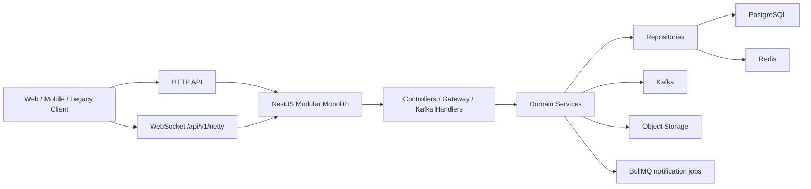

# InfiniteChat NestJS 单体后端

InfiniteChat 是从 `Fork/` 目录中的 Java 多服务项目迁移到 ACK NestJS boilerplate 上的模块化单体后端。目标不是重建微服务，而是在一个 NestJS 应用内保留旧 Java API 路径，完成用户、好友、群聊、IM、离线消息、红包、朋友圈、上传和通知的业务闭环。

ACK boilerplate 提供认证、会话、RBAC、响应、校验、日志、通知、对象存储和工程规范。InfiniteChat 在这个基础上固定使用 PostgreSQL 作为权威业务数据库，Kafka 作为 IM 事件链路，Redis 作为会话、验证码、在线路由、限流和红包领取等低延迟状态基础设施。

## 闭环判断

当前代码层业务流程可以闭环：

- 账号闭环：验证码发送、手机号注册、密码登录、验证码登录、JWT session、头像更新和上传预签名 URL 已接入旧路径。
- 关系闭环：用户搜索、好友申请、申请过期、申请列表、未读数、通过申请、单聊会话、删除好友和拉黑已接入旧路径。
- 群聊闭环：建群、邀请、踢人、退群、成员列表和管理员设置已接入旧路径。
- IM 闭环：HTTP 发送消息、PostgreSQL 持久化、message outbox、Kafka 投递、WebSocket 在线推送、ACK 重试和离线消息拉取已形成链路。
- 扩展业务闭环：红包发送、领取、详情、过期退款、余额流水，以及朋友圈发布、删除、点赞、评论、增量列表和实时通知已接入旧路径。

仍需环境闭环：

- 真实 PostgreSQL、Redis、Kafka、S3/兼容对象存储、邮件服务环境需要执行 `INFINITECHAT_E2E=1 pnpm quality:legacy:full`。
- 部署前需要按环境生成并应用 Prisma migration。不要用 `prisma db push` 作为共享环境迁移路径。
- 多实例生产部署前，WebSocket pending ACK 当前进程内状态需要评估是否升级为 Redis 或 Kafka/outbox 级跨节点重试。

## 架构



核心约束：

- 一个 NestJS 应用，一个部署单元，不拆微服务。
- Controller 只处理路由、DTO、鉴权和响应；Service 编排业务；Repository 访问 PostgreSQL、Redis 或 Kafka。
- PostgreSQL 保存权威业务数据，所有余额、红包、消息和会话关系通过事务或条件更新保证一致性。
- Kafka 用于 IM 事件、消息 outbox、离线持久化事件和实时通知事件。BullMQ 只用于通知等非 IM 后台任务。
- Redis 保存 ACK session、验证码缓存、WebSocket 在线路由、红包原子领取等短期状态。

主要模块：

| 模块 | 职责 |
| --- | --- |
| `user` / `auth` / `session` | 注册、登录、JWT、ACK session、头像、用户基础资料 |
| `verification` | 验证码生成、hash 持久化、Redis TTL、消费校验 |
| `storage` | 上传预签名 URL 和对象访问 URL |
| `contact` | 搜索用户、好友申请、申请过期、删除好友、拉黑 |
| `conversation` | 单聊会话、群聊、群成员和角色 |
| `messaging` | 消息发送、消息落库、message outbox、Kafka 投递 |
| `realtime` | WebSocket 握手、在线路由、心跳、ACK、实时推送 |
| `offline-message` | 按用户会话拉取增量离线消息 |
| `red-packet` | 发红包、抢红包、红包详情、过期退款、余额流水 |
| `moment` | 朋友圈、点赞、评论、增量列表、朋友圈通知 |
| `notification` | ACK 通知体系，承接邮件、推送、站内通知 |

## 注册验证流程

1. 客户端调用 `POST /api/v1/user/common/sendMail`，传入 `email` 和 `phone`。
2. 后端按手机号是否已存在判断验证码目的：未注册为 `register`，已注册为 `login`。
3. `verification` 生成 6 位验证码，只保存 hash。PostgreSQL 写 `VerificationCode`，Redis 写 `verification:<purpose>:email:<target>`，TTL 默认 5 分钟。
4. 邮件验证码通过 ACK notification email 队列发送，API 响应不返回明文验证码。
5. 注册调用 `POST /api/v1/user/register`，传入 `phone`、强密码 `password`、验证码 `code`。
6. 注册事务创建 ACK `User`、`UserMobileNumber`、`UserBalance(1000.00)`、password history、notification settings、2FA 默认记录和 term policy acceptance。
7. 密码登录调用 `POST /api/v1/user/login`，验证码登录调用 `POST /api/v1/user/loginCode`。登录成功创建 ACK device/session/JWT，旧客户端使用响应中的 `token`。
8. 头像更新调用 `PATCH /api/v1/user/avatar`，必须带 ACK access token，更新 `User.avatar` 和兼容头像字段，不返回 password。

## IM 流程

1. 账号登录后拿到 ACK access token。旧登录接口不传 device，兼容层根据 User-Agent、IP、手机号或用户 ID 生成 legacy device fingerprint。
2. 好友关系由 `/api/v1/contact/**` 建立。通过好友申请时，事务中创建双向 `Friend` 和单聊 `Conversation`，并通过 `RealtimeService` 给申请人推送新会话。
3. WebSocket 连接 `WS /api/v1/netty`。握手支持 header `token`、`userUuid`，也支持 query `token`、`userUuid`、`userId`。`token` 可以是裸 token 或 `Bearer <token>`。
4. `RealtimeService` 校验 JWT、session `jti` 和用户标识。通过后写 Redis 在线路由 `user:session:<userId>`，TTL 15 分钟。
5. 客户端调用 `POST /api/v1/chat/session` 发送消息。单聊校验好友和会话成员；群聊校验发送者仍是群成员。
6. `messaging` 在 PostgreSQL transaction 中写 `messages` 和 `message_outboxes`。API 不依赖 Kafka 成功才返回。
7. `MessagingOutboxService` 发布 `im.message.persist`。失败记录 retry 状态，达到上限后投递 `im.dead-letter`。
8. 同进程 Kafka handler 幂等消费 `im.message.persist`。重复 messageId 不重复插入。
9. 在线接收者通过 `RealtimeService.pushMessage` 收到 `{ type, msgUuid, data }`。未在线不阻塞消息持久化。
10. 客户端回 ACK 帧后，服务端删除 pending ACK。超时 5 秒重试，最多 3 次；超过后停止实时重试，但消息仍可离线拉取。
11. 离线或补偿同步调用 `GET /api/v1/offline/message?userId=&time=`，按用户 normal 会话和时间聚合消息。

## IM 模块设计

### 消息发送

`messaging` 是 IM 写入口：

- 请求入口：`POST /api/v1/chat/session`。
- 旧数字协议：`sessionType` 使用 `1=single`、`2=group`；`type` 使用 `1=text`、`2=picture`、`3=file`、`4=video`、`5=redPacket`、`6=emoticon`。
- ID 策略：消息、会话、红包、朋友圈等旧 Java Long 语义实体在兼容响应中返回 string，避免 JavaScript 精度问题。
- 内容策略：`body.content` 是普通消息正文；红包消息额外带 `redPacketId` 和 `redPacketWrapperText`；`body.replyId` 可指向回复消息。

### Outbox 和 Kafka

`message_outboxes` 是 Kafka 可靠投递的事务 outbox：

- 创建消息时同事务写 outbox。
- 发布成功标记 sent。
- 发布失败标记 failed，记录 `retryCount`、`nextRetryAt` 和 `lastError`。
- 定时 processor 扫描 init、failed 和过期 pending outbox。
- 到达最大重试后投递 `im.dead-letter`，payload 只保留排障标识和错误摘要。

Kafka topic：

| Topic | 用途 |
| --- | --- |
| `im.message.persist` | 消息持久化事件 |
| `im.realtime.push` | 实时推送事件预留 |
| `im.friend.application` | 好友申请事件预留 |
| `im.conversation.created` | 会话创建事件预留 |
| `im.moment.created` | 朋友圈事件预留 |
| `im.red-packet.created` | 红包事件预留 |
| `im.dead-letter` | outbox 最终失败死信 |

Kafka envelope：

```json
{
  "eventId": "uuid",
  "eventType": "im.message.persist",
  "occurredAt": "2026-07-09T12:00:00.000Z",
  "aggregateId": "conversationId-or-messageId",
  "causationId": null,
  "correlationId": null,
  "payload": {}
}
```

### WebSocket realtime

连接地址：

```text
ws://<host>/api/v1/netty?token=<accessToken>&userUuid=<userId>
```

客户端帧：

```json
{
  "type": 5,
  "msgUuid": "optional-message-id",
  "data": {}
}
```

客户端 type：

| type | 含义 | 参数 |
| --- | --- | --- |
| `1` | ACK | `msgUuid` 必须等于服务端推送的 `msgUuid`，也可放在 `data.msgUuid` |
| `2` | LOG_OUT | 清理连接、在线路由和该用户 pending ACK |
| `5` | HEART_BEAT | 刷新 Redis 在线路由 TTL，服务端回 `type=5` |

服务端推送：

```json
{
  "type": 2,
  "msgUuid": "2:userId:messageId",
  "data": {}
}
```

服务端 type：

| type | 含义 | data 来源 |
| --- | --- | --- |
| `1` | 新会话通知 | 好友通过、建群、邀请入群 |
| `2` | 消息通知 | `messaging` 发送消息 |
| `3` | 朋友圈通知 | 发布、点赞、评论 |
| `4` | 好友申请通知 | 发起好友申请 |

## API 和参数

通用规则：

- HTTP API 默认挂载在 `/api/v1`。
- JWT 保护接口使用 `Authorization: Bearer <token>`。
- 响应走 ACK response envelope：`statusCode`、`message`、`data`、可选 `metadata`。
- `userId`、`creatorId`、`sendUserId`、`receiverId` 等兼容用户标识可以是 ACK UUID、旧 `legacyId` 字符串或手机号。受保护接口会校验解析后的 ACK `User.id` 必须等于 token subject。

### 用户、验证和上传

| 方法 | 路径 | 鉴权 | 参数 | 含义 |
| --- | --- | --- | --- | --- |
| `POST` | `/api/v1/user/common/sendMail` | 否 | body `email: string`, `phone: string` | 向邮箱发送验证码。手机号不存在时用于注册，已存在时用于验证码登录 |
| `POST` | `/api/v1/user/common/check` | 否 | query `email: string`, `code: string` | 校验邮箱验证码，成功后标记 used 并删除 Redis key |
| `POST` | `/api/v1/user/common/uploadUrl` | 否 | body `fileName: string` | 返回 `uploadUrl` 和 `downloadUrl`，用于头像或媒体上传 |
| `POST` | `/api/v1/user/register` | 否 | body `phone: string`, `password: string`, `code: string` | 手机号注册。密码使用 ACK 强规则，验证码按 register purpose 消费 |
| `POST` | `/api/v1/user/login` | 否 | body `phone: string`, `password: string` | 手机号密码登录，返回旧兼容用户字段和 access token |
| `POST` | `/api/v1/user/loginCode` | 否 | body `phone: string`, `code: string` | 手机号验证码登录，返回旧兼容用户字段和 access token |
| `PATCH` | `/api/v1/user/avatar` | 是 | body `avatarUrl: string` | 更新当前用户头像 URL |

### 联系人和群聊

| 方法 | 路径 | 鉴权 | 参数 | 含义 |
| --- | --- | --- | --- | --- |
| `GET` | `/api/v1/contact/{userUuid}/user` | 是 | path `userUuid`, query `phone` | 当前用户按手机号搜索目标用户 |
| `POST` | `/api/v1/contact/{userUuid}/friend/{receiverUuid}` | 是 | path `userUuid`, `receiverUuid`, body `msg?: string` | 发起好友申请，申请 72 小时过期 |
| `GET` | `/api/v1/contact/{userUuid}/friend/{friendUuid}` | 是 | path `userUuid`, `friendUuid` | 查询好友详情和单聊会话信息 |
| `GET` | `/api/v1/contact/{userUuid}/applyCount` | 是 | path `userUuid` | 查询未读好友申请数量 |
| `GET` | `/api/v1/contact/{userUuid}/apply` | 是 | path `userUuid`, query `pageNum?: number`, `pageSize?: number`, `key?: string` | 分页查询好友申请列表 |
| `POST` | `/api/v1/contact/{userUuid}/application/{status}` | 是 | path `userUuid`, `status`, body `receiveUserUuids: string[]` | 修改申请状态。旧状态 `1=accepted`、`3=read` |
| `DELETE` | `/api/v1/contact/{userUuid}/friend/{receiverUuid}` | 是 | path `userUuid`, `receiverUuid` | 删除好友并软删除单聊关系 |
| `POST` | `/api/v1/contact/{userUuid}/block/{receiverUuid}` | 是 | path `userUuid`, `receiverUuid` | 拉黑好友 |
| `POST` | `/api/v1/contact/groups` | 是 | body `creatorId: string`, `memberIds: string[]` | 创建群聊。创建者为 owner，成员为 member |
| `POST` | `/api/v1/contact/group/invite` | 是 | body `sessionId: string`, `inviterId: string`, `inviteeIds: string[]` | owner 或 admin 邀请好友入群 |
| `POST` | `/api/v1/contact/group/kick` | 是 | body `sessionId: string`, `operatorId: string`, `memberIds: string[]` | owner 或 admin 踢出群成员 |
| `POST` | `/api/v1/contact/group/exit` | 是 | body `sessionId: string`, `userId: string` | 用户退出群聊 |
| `GET` | `/api/v1/contact/group/{conversationId}/members` | 是 | path `conversationId` | 查询群成员列表 |
| `POST` | `/api/v1/contact/group/setAdmin` | 是 | body `sessionId: string`, `userId: string`, `targetId: string`, `isAdmin: boolean` | 群主设置或取消管理员 |

### IM、离线消息和红包

| 方法 | 路径 | 鉴权 | 参数 | 含义 |
| --- | --- | --- | --- | --- |
| `POST` | `/api/v1/chat/session` | 是 | body `sessionId`, `sendUserId`, `sessionType`, `type`, `receiveUserId?`, `body` | 发送单聊或群聊消息。单聊必须传 `receiveUserId` |
| `GET` | `/api/v1/offline/message` | 是 | query `userId: string`, `time: string` | 拉取指定时间后的离线消息。`time` 格式为 `YYYY-MM-DD HH:mm:ss` |
| `POST` | `/api/v1/chat/redPacket/send` | 是 | body `sessionId`, `sendUserId`, `receiveUserId?`, `type=5`, `sessionType`, `body.redPacketType`, `body.totalAmount`, `body.totalCount`, `body.redPacketWrapperText?` | 发红包并发送红包消息 |
| `POST` | `/api/v1/chat/redPacket/receive` | 是 | body `userId: string`, `redPacketId: string` | 领取红包 |
| `GET` | `/api/v1/chat/redPacket/{redPacketId}` | 是 | path `redPacketId`, query `pageNum?: number`, `pageSize?: number` | 查询红包详情和领取列表 |
| `WS` | `/api/v1/netty` | 是 | header/query `token`, `userUuid?`, `userId?` | 旧 WebSocket 兼容入口 |

IM 字段含义：

| 字段 | 含义 |
| --- | --- |
| `sessionId` | 会话 ID，BigInt 字符串 |
| `sendUserId` | 发送者兼容用户标识，必须解析为当前 JWT 用户 |
| `receiveUserId` | 单聊接收者兼容用户标识。群聊可不传 |
| `sessionType` | `1=single`、`2=group` |
| `type` | `1=text`、`2=picture`、`3=file`、`4=video`、`5=redPacket`、`6=emoticon` |
| `body.content` | 文本、图片 URL、文件 URL、视频 URL、表情编码或红包 ID |
| `body.replyId` | 可选，被回复消息 ID |
| `body.redPacketId` | 红包消息对应红包 ID |
| `body.redPacketWrapperText` | 红包封面文案 |

红包字段含义：

| 字段 | 含义 |
| --- | --- |
| `redPacketType` | `1=normal` 普通红包，`2=random` 随机红包 |
| `totalAmount` | 红包总金额字符串，最多两位小数 |
| `totalCount` | 红包个数，最小 1 |
| `redPacketWrapperText` | 可选封面文案，默认使用系统祝福语 |

### 朋友圈

| 方法 | 路径 | 鉴权 | 参数 | 含义 |
| --- | --- | --- | --- | --- |
| `POST` | `/api/v1/moment` | 是 | body `userId: string`, `text?: string`, `mediaUrls?: string[]` | 发布朋友圈。文本和媒体不能同时为空 |
| `DELETE` | `/api/v1/moment/{momentId}` | 是 | path `momentId`, query `userId: string` | 删除自己的朋友圈，并软删除关联点赞评论 |
| `POST` | `/api/v1/moment/like/{momentId}` | 是 | path `momentId`, body `userId: string` | 点赞朋友圈。重复点赞会恢复软删除点赞 |
| `DELETE` | `/api/v1/moment/like/{momentId}` | 是 | path `momentId`, query `likeId: string`, `userId: string` | 取消自己的点赞 |
| `POST` | `/api/v1/moment/comment/{momentId}` | 是 | path `momentId`, body `userId: string`, `comment: string`, `parentCommentId?: string` | 评论朋友圈，支持回复父评论 |
| `DELETE` | `/api/v1/moment/comment/{momentId}` | 是 | path `momentId`, query `commentId: string`, `userId: string` | 删除自己的评论，并标记直接子评论删除 |
| `GET` | `/api/v1/moment/list/{userId}` | 是 | path `userId`, query `time: string` | 拉取自己和 normal 好友可见的增量动态 |

## 本地运行和验证

安装依赖：

```bash
pnpm install
```

准备环境：

```bash
cp .env.example .env
pnpm generate:keys --direct-insert
```

启动 Docker 依赖：

```bash
docker compose up -d postgres redis kafka jwks-server redis-bullboard
```

数据库初始化：

```bash
pnpm db:generate
pnpm db:migrate
pnpm migration:seed
```

启动完整 Docker 后端：

```bash
docker compose --profile apis up -d --build
docker compose --profile apis ps
curl --noproxy '*' -fsS http://localhost:3011/.well-known/access-jwks.json
curl --noproxy '*' -fsS http://localhost:3000/api/public/hello
```

默认 `docker compose up -d` 只启动 PostgreSQL、Kafka、Redis、JWKS server 和 BullMQ dashboard。后端 API 保留在 `apis` profile 中，完整启动命令是 `docker compose --profile apis up -d --build`。`.env` 保持 host 本地开发友好的 `localhost` 地址，API 容器内的 PostgreSQL、Redis、Kafka 和 JWKS 地址由 `docker-compose.yml` 覆盖为 compose service name。API 容器启动 Nest 前会确保 InfiniteChat IM Kafka topics 已存在，避免首次启动依赖 Kafka 自动建 topic。

Swagger 文档默认在非生产环境开放。生产环境会按 ACK 规则关闭文档。

本地门禁：

```bash
pnpm typecheck
pnpm lint
pnpm spell
pnpm test
pnpm build
git diff --check
```

真实环境闭环验收：

```bash
INFINITECHAT_E2E=1 pnpm quality:legacy:full
```

`quality:legacy:full` 需要可重置测试环境、测试账号、测试数据、Kafka broker、Redis、PostgreSQL、对象存储和邮件配置。不要对生产环境运行 full 探针。

## 相关文档

- [AGENTS.md](AGENTS.md)：后续 agent 执行规则和项目硬约束。
- [spec.md](spec.md)：迁移规范、领域模型、API 兼容要求和验收标准。
- [plan.md](plan.md)：阶段计划和当前完成状态。
- [docs/legacy-api.md](docs/legacy-api.md)：旧 Java 兼容 API 路由表。
- [docs/quality.md](docs/quality.md)：真实环境 smoke、WebSocket/Kafka smoke 和压测入口。
- [docs/database.md](docs/database.md)：PostgreSQL、Prisma migration 和 seed。
- [docs/queue.md](docs/queue.md)：BullMQ 非 IM 队列和 Kafka IM 事件边界。

## 安全说明

- 不迁移 `Fork/*/target/classes/application.yml` 中的旧明文凭据。发现旧凭据只记录“需要轮换”，不要复制值。
- API 响应不返回 password、token secret、验证码明文或对象存储密钥。
- 日志遵守 Pino redaction 规则，代码仍禁止主动记录 password、token、apiKey、secret、private key。
- 旧 Java 的 Nacos、Gateway、Feign 和内部 HTTP 自调用不迁移。目标只保留旧 API path 和 WebSocket path。
