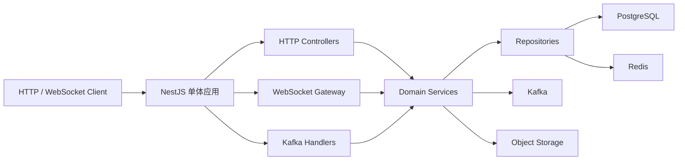

# InfiniteChat NestJS 单体迁移开发规范

## 1. 范围

本规范定义把 `Fork/` 中 Java InfiniteChat 项目迁移到当前 ACK NestJS boilerplate 的目标行为、领域模型、API 兼容要求、事件规范和验收标准。

本规范不包含：

- 前端 UI 实现。
- 微服务拆分。
- Nacos、Spring Cloud Gateway、Feign 的迁移。
- 旧 Java target 产物里的明文环境值迁移。

## 2. 架构规范

目标架构是单个 NestJS 应用：



规范：

- 一个后端进程，一个部署单元。
- 领域按 Nest module 分离，不按部署服务分离。
- PostgreSQL 保存权威业务数据。
- Kafka 负责 IM 事件、离线落库和通知事件。
- Redis 保存短期状态和高并发原子状态。
- HTTP 内部自调用禁止。旧 Java 的 Feign 和 OkHttp 服务间调用改为 service 调用或 Kafka 事件。

## 3. 模块规范

| 模块              | 职责                                 | Java 来源                                     |
| ----------------- | ------------------------------------ | --------------------------------------------- |
| `user`            | 用户资料、注册时用户数据、头像       | `AuthenticationService`                       |
| `auth`            | 登录、JWT、会话、验证码登录          | `AuthenticationService` 和 boilerplate        |
| `verification`    | 邮箱或短信验证码                     | `AuthenticationService`                       |
| `storage`         | 上传预签名 URL、下载 URL             | `AuthenticationService` 和 boilerplate AWS/S3 |
| `contact`         | 好友搜索、申请、通过、删除、拉黑     | `ContactService`                              |
| `conversation`    | 单聊、群聊、成员、角色、管理员       | `ContactService`                              |
| `messaging`       | 发送消息、outbox、消息事件           | `MessagingService`                            |
| `realtime`        | WebSocket、在线路由、心跳、ACK、推送 | `RealTimeCommunicationService`                |
| `offline-message` | Kafka 消费、离线消息查询             | `OfflineDataStoreService`                     |
| `red-packet`      | 红包发送、领取、详情、退款、流水     | `MessagingService`                            |
| `moment`          | 朋友圈、点赞、评论、增量列表         | `MomentService`                               |
| `notification`    | 通知模板和通道复用                   | boilerplate 和各 Java service                 |

## 4. 领域实体

### 4.1 User

字段语义：

- `id`：用户 ID，建议 PostgreSQL `BigInt` 或可兼容旧 ID 的 string 输出。
- `username`：昵称，对应旧 `user_name`。
- `passwordHash`：密码 hash。禁止沿用旧 MD5，目标使用 bcrypt 或 boilerplate 现有安全实现。
- `email`：邮箱，可为空。
- `phone`：手机号，唯一。
- `avatar`：头像 URL。
- `signature`：个性签名。
- `gender`：`male`、`female`、`secret`。
- `status`：`active`、`blocked`、`deleted`。
- `createdAt`、`updatedAt`。

规则：

- 注册手机号唯一。
- 登录只允许 `active` 用户。
- 对外不返回 `passwordHash`。
- 注册成功必须创建 `UserBalance`。

### 4.2 UserBalance

字段语义：

- `userId`：用户 ID。
- `balance`：余额，Decimal。
- `createdAt`、`updatedAt`。

规则：

- 金额计算禁止使用 JS number。
- 扣款必须使用条件更新：余额足够时才扣减。
- 所有余额变化必须写 `BalanceLog`。

### 4.3 VerificationCode

字段语义：

- `id`
- `target`：手机号或邮箱。
- `channel`：`sms` 或 `email`。
- `codeHash`：验证码 hash，不能明文持久化到 PostgreSQL。
- `purpose`：`register`、`login`、`resetPassword`。
- `expiredAt`
- `usedAt`
- `createdAt`

规则：

- Redis 可保存短期验证码状态。
- 校验成功后必须标记已使用或删除 Redis key。
- 验证码错误或过期返回明确错误。

### 4.4 FriendApplication

字段语义：

- `id`
- `senderId`
- `receiverId`
- `message`
- `status`：`unread`、`accepted`、`rejected`、`read`、`expired`。
- `createdAt`、`updatedAt`

规则：

- 同一发送者对同一接收者不能无限创建重复未处理申请。
- 通过申请时必须在事务中创建好友关系和单聊会话。
- 已过期申请不能通过。
- 申请通知通过 realtime 或 Kafka 推送。

### 4.5 Friend

字段语义：

- `id`
- `userId`
- `friendId`
- `status`：`normal`、`blocked`、`deleted`。
- `createdAt`、`updatedAt`

规则：

- 好友关系是双向两条记录。
- 单聊消息发送要求发送者到接收者的关系为 `normal`。
- 拉黑只影响发起方到对方的关系。

### 4.6 Conversation

对应旧 `session`。

字段语义：

- `id`
- `name`
- `type`：`single`、`group`。
- `status`：`normal`、`deleted`。
- `createdAt`、`updatedAt`

规则：

- 单聊会话由通过好友申请创建。
- 群聊由创建者和成员列表创建。
- 群名默认由成员昵称拼接，最多 16 个字符，后续可扩展修改群名。

### 4.7 ConversationMember

对应旧 `user_session`。

字段语义：

- `id`
- `conversationId`
- `userId`
- `role`：`owner`、`admin`、`member`。
- `status`：`normal`、`deleted`。
- `createdAt`、`updatedAt`

规则：

- 群主可以邀请、踢人、设置管理员。
- 管理员可以邀请和踢普通成员，不能踢群主或管理员。
- 普通成员不能管理群。
- 退群删除或标记成员关系，不能破坏历史消息。

### 4.8 Message

字段语义：

- `id`
- `senderId`
- `conversationId`
- `conversationType`
- `type`：`text`、`picture`、`file`、`video`、`redPacket`、`emoticon`。
- `content`
- `body`：JSON，存不同消息类型的扩展结构。
- `replyId`
- `createdAt`、`updatedAt`

规则：

- 消息 ID 是幂等主键。
- 文本消息 body 至少包含 `content` 和可选 `replyId`。
- 图片消息 body 至少包含 `url`、`size`、可选 `replyId`。
- 红包消息 body 包含 `redPacketId` 和 `redPacketWrapperText`。
- 单聊消息必须校验好友关系。
- 群聊消息必须校验发送者仍在群内。

### 4.9 MessageOutbox

字段语义：

- `id`
- `messageId`
- `topic`
- `messageKey`
- `payload`
- `status`：`init`、`pending`、`sent`、`failed`。
- `retryCount`
- `nextRetryAt`
- `lastError`
- `createdAt`、`updatedAt`

规则：

- 创建业务消息和 outbox 必须在同一事务中完成。
- Kafka 投递成功后标记 `sent`。
- 投递失败标记 `failed` 并设置下次重试时间。
- pending 超时后允许重新投递。

### 4.10 RedPacket

字段语义：

- `id`
- `senderId`
- `conversationId`
- `wrapperText`
- `type`：`normal`、`random`。
- `totalAmount`
- `totalCount`
- `remainingAmount`
- `remainingCount`
- `status`：`unclaimed`、`claimed`、`expired`、`refunding`。
- `createdAt`
- `expireAt`

规则：

- 最小单个金额 0.01。
- 单个红包最大金额 200。
- 默认过期时间 24 小时。
- 普通红包平均拆分，最后一个红包补差额。
- 随机红包不能低于最小金额，且总和必须等于总额。
- 红包消息发送失败时，必须回滚或补偿。

### 4.11 RedPacketReceive

字段语义：

- `id`
- `redPacketId`
- `receiverId`
- `amount`
- `receivedAt`

规则：

- `redPacketId + receiverId` 唯一。
- Redis Lua 先抢占，PostgreSQL 事务落库失败时补偿 Redis。
- 红包已抢完返回已领完状态。
- 已领取用户再次领取返回已领取金额。

### 4.12 BalanceLog

字段语义：

- `id`
- `userId`
- `amount`
- `type`：`sendRedPacket`、`receiveRedPacket`、`refundRedPacket`。
- `relatedId`
- `createdAt`

规则：

- 发红包为负数。
- 领红包和退款为正数。
- 每次余额变化都必须有流水。

### 4.13 Moment

字段语义：

- `id`
- `userId`
- `text`
- `mediaUrls`：JSON array 或关系表，第一版可 JSON。
- `createdAt`
- `updatedAt`
- `deletedAt`

规则：

- 只有作者能删除朋友圈。
- 删除使用软删除。
- 可见范围是自己和好友。

### 4.14 MomentLike

字段语义：

- `id`
- `momentId`
- `userId`
- `isDeleted`
- `createdAt`
- `updatedAt`

规则：

- 同一用户对同一朋友圈只能有一个有效点赞。
- 取消点赞使用软删除。
- 点赞他人朋友圈时通知作者。

### 4.15 MomentComment

字段语义：

- `id`
- `momentId`
- `userId`
- `parentCommentId`
- `content`
- `isDeleted`
- `createdAt`
- `updatedAt`

规则：

- 支持回复评论。
- 删除父评论时子评论也标记删除。
- 评论他人朋友圈时通知作者。

## 5. API 兼容规范

第一版保留旧 Java API 路径，内部实现可以使用 Nest 标准模块。

| 方法   | 路径                                             | 目标模块          | 说明               |
| ------ | ------------------------------------------------ | ----------------- | ------------------ |
| POST   | `/api/v1/user/register`                          | `auth` / `user`   | 手机号注册         |
| POST   | `/api/v1/user/login`                             | `auth`            | 密码登录           |
| POST   | `/api/v1/user/loginCode`                         | `auth`            | 验证码登录         |
| PATCH  | `/api/v1/user/avatar`                            | `user`            | 更新头像           |
| POST   | `/api/v1/user/common/sendMail`                   | `verification`    | 发送邮箱验证码     |
| POST   | `/api/v1/user/common/check`                      | `verification`    | 校验验证码         |
| POST   | `/api/v1/user/common/uploadUrl`                  | `storage`         | 获取上传预签名 URL |
| GET    | `/api/v1/contact/{userId}/user`                  | `contact`         | 搜索用户           |
| POST   | `/api/v1/contact/{userId}/friend/{receiverId}`   | `contact`         | 发起好友申请       |
| GET    | `/api/v1/contact/{userId}/friend/{friendId}`     | `contact`         | 好友详情           |
| GET    | `/api/v1/contact/{userId}/applyCount`            | `contact`         | 未读申请数         |
| GET    | `/api/v1/contact/{userId}/apply`                 | `contact`         | 申请列表           |
| POST   | `/api/v1/contact/{userId}/application/{status}`  | `contact`         | 修改申请状态       |
| DELETE | `/api/v1/contact/{userId}/friend/{receiverId}`   | `contact`         | 删除好友           |
| POST   | `/api/v1/contact/{userId}/block/{receiverId}`    | `contact`         | 拉黑好友           |
| POST   | `/api/v1/contact/groups`                         | `conversation`    | 创建群聊           |
| POST   | `/api/v1/contact/group/invite`                   | `conversation`    | 邀请入群           |
| POST   | `/api/v1/contact/group/kick`                     | `conversation`    | 踢出群成员         |
| POST   | `/api/v1/contact/group/exit`                     | `conversation`    | 退出群聊           |
| GET    | `/api/v1/contact/group/{conversationId}/members` | `conversation`    | 群成员             |
| POST   | `/api/v1/contact/group/setAdmin`                 | `conversation`    | 设置管理员         |
| POST   | `/api/v1/chat/session`                           | `messaging`       | 发送消息           |
| POST   | `/api/v1/chat/redPacket/send`                    | `red-packet`      | 发红包             |
| POST   | `/api/v1/chat/redPacket/receive`                 | `red-packet`      | 领红包             |
| GET    | `/api/v1/chat/redPacket/{redPacketId}`           | `red-packet`      | 红包详情           |
| GET    | `/api/v1/offline/message`                        | `offline-message` | 离线消息           |
| POST   | `/api/v1/moment`                                 | `moment`          | 发布朋友圈         |
| DELETE | `/api/v1/moment/{momentId}`                      | `moment`          | 删除朋友圈         |
| POST   | `/api/v1/moment/like/{momentId}`                 | `moment`          | 点赞               |
| DELETE | `/api/v1/moment/like/{momentId}`                 | `moment`          | 取消点赞           |
| POST   | `/api/v1/moment/comment/{momentId}`              | `moment`          | 评论               |
| DELETE | `/api/v1/moment/comment/{momentId}`              | `moment`          | 删除评论           |
| GET    | `/api/v1/moment/list/{userId}`                   | `moment`          | 动态增量列表       |
| WS     | `/api/v1/netty`                                  | `realtime`        | WebSocket          |

响应规范：

- 新实现优先使用 ACK response 体系。
- 对旧路径返回体保持 `code`、`msg`、`data` 的兼容语义，具体可以由响应拦截器统一适配。
- 错误信息必须走 exception + i18n message key，禁止直接散落硬编码错误字符串，兼容层可映射旧错误码。

## 6. WebSocket 帧规范

客户端发给服务端：

```json
{
    "type": 5,
    "msgUuid": "optional",
    "data": {}
}
```

类型：

- `1`：ACK。
- `2`：LOG_OUT。
- `5`：HEART_BEAT。

服务端推送：

```json
{
    "type": 2,
    "msgUuid": "2:receiverId:businessId",
    "data": {}
}
```

推送类型：

- `1`：新会话通知。
- `2`：消息通知。
- `3`：朋友圈通知。
- `4`：好友申请通知。

规则：

- `msgUuid` 必须唯一且可幂等。
- 客户端收到需要确认的推送后，以 ACK 类型回传同一个 `msgUuid`。
- 心跳回包使用 type `5`。
- 登出后服务端关闭连接并清理 route。

## 7. Kafka 事件规范

统一事件 envelope：

```json
{
    "eventId": "string",
    "eventType": "im.message.created",
    "version": 1,
    "occurredAt": "2026-07-07T00:00:00.000Z",
    "producer": "infinite-chat-api",
    "key": "conversationId-or-userId",
    "payload": {}
}
```

规则：

- `eventId` 唯一，用于幂等。
- `eventType` 必须和 topic 语义一致。
- `version` 从 1 开始，变更 payload 时递增。
- `payload` 不包含密码、token、验证码。
- consumer 失败要记录错误并可重试。

核心事件：

- `im.message.created`：消息已创建，触发实时推送和离线持久化。
- `im.message.persist`：消息持久化请求。
- `im.realtime.push`：实时推送请求。
- `im.friend.application`：好友申请事件。
- `im.conversation.created`：会话创建事件。
- `im.moment.created`：朋友圈创建事件。
- `im.red-packet.created`：红包消息事件。

## 8. 关键业务流程

### 8.1 注册

1. 用户请求验证码。
2. `verification` 生成验证码并保存 Redis TTL。
3. 用户提交手机号、密码、验证码。
4. 校验验证码。
5. 校验手机号未注册。
6. 使用 bcrypt hash 密码。
7. 在事务中创建用户和余额。
8. 返回用户基础信息。

### 8.2 登录

1. 用户提交手机号和密码，或手机号和验证码。
2. 校验用户存在且状态为 `active`。
3. 校验密码或验证码。
4. 复用 boilerplate JWT 和 session 能力生成 access token。
5. 返回用户信息和 token。

### 8.3 通过好友申请

1. 接收者请求通过申请。
2. 校验申请存在且未过期。
3. 在事务中更新申请状态为 `accepted`。
4. 创建双向好友关系。
5. 创建单聊会话。
6. 创建双方会话成员关系。
7. 推送新会话通知。

### 8.4 发送消息

1. 校验发送者状态。
2. 根据会话类型校验好友关系或群成员关系。
3. 生成消息 ID 和消息 body。
4. 在事务中保存消息和 outbox。
5. outbox 投递 Kafka。
6. 实时在线接收者收到 WebSocket 推送。
7. 离线接收者通过离线消息接口拉取。
8. 客户端 ACK 后服务端删除待确认记录。

### 8.5 领取红包

1. 用户点击红包。
2. Redis Lua 判断是否已领取，并弹出一个预拆金额。
3. 查询红包状态。
4. PostgreSQL 条件更新红包剩余金额和数量。
5. 写领取记录。
6. 增加用户余额。
7. 写余额流水。
8. 如果数据库失败，补偿 Redis。
9. 返回领取金额和红包状态。

### 8.6 朋友圈增量列表

1. 用户传入上次同步时间。
2. 查询自己和好友 ID。
3. 查询时间之后的朋友圈、点赞、评论。
4. 过滤不可见数据。
5. 返回新增和删除集合。

## 9. 安全规范

- 密码必须 bcrypt hash，禁止 MD5。
- JWT 私钥、公钥、Kafka、PostgreSQL、Redis、邮箱、对象存储凭据全部来自环境变量。
- 旧 Java 配置里的明文凭据需要轮换，不能复制到新项目。
- 日志禁止输出密码、验证码、token、完整 Authorization header。
- WebSocket 握手必须鉴权。
- 红包、余额、消息等核心写操作必须校验当前用户权限。
- 文件上传预签名 URL 必须限制过期时间、文件名、MIME 和大小。

## 10. 一致性规范

- PostgreSQL 事务包住同一业务不变量内的写操作。
- Kafka outbox 保证消息事件不会因投递失败而丢失。
- Redis 只保存可重建或短期状态。
- 红包领取使用 Redis 原子脚本和 PostgreSQL 条件更新双保险。
- Kafka consumer 必须幂等。
- ACK 超时不影响消息持久化，实时推送失败时由离线消息兜底。

## 11. 验收标准

功能验收：

- 用户可以注册、登录、验证码登录、更新头像。
- 用户可以搜索、申请、通过、删除、拉黑好友。
- 用户可以创建群聊、邀请、踢人、退群、设置管理员、查看成员。
- 用户可以建立 WebSocket 连接并收发心跳。
- 在线消息可以实时收到，离线消息可以拉取。
- 红包可以发送、领取、查询和过期退款。
- 朋友圈可以发布、删除、点赞、评论、增量同步。

工程验收：

- `pnpm typecheck` 通过。
- `pnpm lint` 通过。
- `pnpm spell` 通过，或仅有明确允许的词。
- `pnpm build` 通过。
- PostgreSQL schema 可生成 Prisma client。
- Kafka 和 Redis 配置可通过本地环境启动。
- Swagger 或 API 文档覆盖核心旧路径。

文档验收：

- `AGENTS.md`、`plan.md`、`spec.md` 均为中文。
- 文档中不再把 MongoDB 写成目标数据库。
- 文档中不再把 BullMQ 写成 IM 消息队列。
- 文档明确“不做微服务”。
- 文档明确直接使用当前 ACK NestJS boilerplate。
