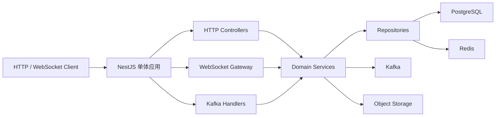

# InfiniteChat NestJS 单体迁移开发规范

## 1. 范围

本规范定义把 `Fork/` 中 Java InfiniteChat 项目迁移到当前 ACK NestJS boilerplate 的目标行为、领域模型、API 兼容要求、事件规范和验收标准。

本规范不包含：

- 前端 UI 实现。
- 微服务拆分。
- Nacos、Spring Cloud Gateway、Feign 的迁移。
- 旧 Java target 产物里的明文环境值迁移。

## 2. 架构规范

目标架构是单个 NestJS 应用：



规范：

- 一个后端进程，一个部署单元。
- 领域按 Nest module 分离，不按部署服务分离。
- PostgreSQL 保存权威业务数据。
- Kafka 负责 IM 事件、离线落库和通知事件。
- Redis 保存短期状态和高并发原子状态。
- HTTP 内部自调用禁止。旧 Java 的 Feign 和 OkHttp 服务间调用改为 service 调用或 Kafka 事件。

## 3. 模块规范

| 模块              | 职责                                 | Java 来源                                     |
| ----------------- | ------------------------------------ | --------------------------------------------- |
| `user`            | 用户资料、注册时用户数据、头像       | `AuthenticationService`                       |
| `auth`            | 登录、JWT、会话、验证码登录          | `AuthenticationService` 和 boilerplate        |
| `verification`    | 邮箱或短信验证码                     | `AuthenticationService`                       |
| `storage`         | 上传预签名 URL、下载 URL             | `AuthenticationService` 和 boilerplate AWS/S3 |
| `contact`         | 好友搜索、申请、通过、删除、拉黑     | `ContactService`                              |
| `conversation`    | 单聊、群聊、成员、角色、管理员       | `ContactService`                              |
| `messaging`       | 发送消息、outbox、消息事件           | `MessagingService`                            |
| `realtime`        | WebSocket、在线路由、心跳、ACK、推送 | `RealTimeCommunicationService`                |
| `offline-message` | Kafka 消费、离线消息查询             | `OfflineDataStoreService`                     |
| `red-packet`      | 红包发送、领取、详情、退款、流水     | `MessagingService`                            |
| `moment`          | 朋友圈、点赞、评论、增量列表         | `MomentService`                               |
| `notification`    | 通知模板和通道复用                   | boilerplate 和各 Java service                 |

## 4. 领域实体

### 4.1 User

字段语义：

- `id`：用户 ID。当前 ACK boilerplate 已使用 PostgreSQL UUID 主键，迁移时保持不变。
- `legacyId`：旧 Java `Long` 用户 ID 的可选兼容字段，使用 PostgreSQL `BigInt`，对外响应统一转 string。
- `username`：昵称，对应旧 `user_name`。
- `passwordHash`：密码 hash。禁止沿用旧 MD5，目标使用 bcrypt 或 boilerplate 现有安全实现。
- `email`：邮箱，可为空。
- `phone`：手机号，唯一。
- `avatar`：头像 URL。
- `signature`：个性签名。
- `gender`：`male`、`female`、`secret`。
- `status`：`active`、`blocked`、`deleted`。
- `createdAt`、`updatedAt`。

规则：

- 注册手机号唯一。
- 登录只允许 `active` 用户。
- 对外不返回 `passwordHash`。
- 注册成功必须创建 `UserBalance`。
- 手机号优先复用 ACK 的 `UserMobileNumber` 结构，旧路径响应可以由兼容层组装为 `phone`。

### 4.2 UserBalance

字段语义：

- `userId`：用户 ID。
- `balance`：余额，Decimal。
- `createdAt`、`updatedAt`。

规则：

- 金额计算禁止使用 JS number。
- 扣款必须使用条件更新：余额足够时才扣减。
- 所有余额变化必须写 `BalanceLog`。

### 4.3 VerificationCode

字段语义：

- `id`
- `target`：手机号或邮箱。
- `channel`：`sms` 或 `email`。
- `codeHash`：验证码 hash，不能明文持久化到 PostgreSQL。
- `purpose`：`register`、`login`、`resetPassword`。
- `expiredAt`
- `usedAt`
- `createdAt`

规则：

- Redis 可保存短期验证码状态。
- 校验成功后必须标记已使用或删除 Redis key。
- 验证码错误或过期返回明确错误。

### 4.4 FriendApplication

字段语义：

- `id`
- `senderId`
- `receiverId`
- `message`
- `status`：`unread`、`accepted`、`rejected`、`read`、`expired`。
- `createdAt`、`updatedAt`

规则：

- 同一发送者对同一接收者不能无限创建重复未处理申请。
- 通过申请时必须在事务中创建好友关系和单聊会话。
- 已过期申请不能通过。
- 申请通知通过 realtime 或 Kafka 推送。

### 4.5 Friend

字段语义：

- `id`
- `userId`
- `friendId`
- `status`：`normal`、`blocked`、`deleted`。
- `createdAt`、`updatedAt`

规则：

- 好友关系是双向两条记录。
- 单聊消息发送要求发送者到接收者的关系为 `normal`。
- 拉黑只影响发起方到对方的关系。

### 4.6 Conversation

对应旧 `session`。

字段语义：

- `id`
- `name`
- `type`：`single`、`group`。
- `status`：`normal`、`deleted`。
- `createdAt`、`updatedAt`

规则：

- 单聊会话由通过好友申请创建。
- 群聊由创建者和成员列表创建。
- 群名默认由成员昵称拼接，最多 16 个字符，后续可扩展修改群名。

### 4.7 ConversationMember

对应旧 `user_session`。

字段语义：

- `id`
- `conversationId`
- `userId`
- `role`：`owner`、`admin`、`member`。
- `status`：`normal`、`deleted`。
- `createdAt`、`updatedAt`

规则：

- 群主可以邀请、踢人、设置管理员。
- 管理员可以邀请和踢普通成员，不能踢群主或管理员。
- 普通成员不能管理群。
- 退群删除或标记成员关系，不能破坏历史消息。

### 4.8 Message

字段语义：

- `id`
- `senderId`
- `conversationId`
- `conversationType`
- `type`：`text`、`picture`、`file`、`video`、`redPacket`、`emoticon`。
- `content`
- `body`：JSON，存不同消息类型的扩展结构。
- `replyId`
- `createdAt`、`updatedAt`

规则：

- 消息 ID 是幂等主键。
- 文本消息 body 至少包含 `content` 和可选 `replyId`。
- 图片消息 body 至少包含 `url`、`size`、可选 `replyId`。
- 红包消息 body 包含 `redPacketId` 和 `redPacketWrapperText`。
- 单聊消息必须校验好友关系。
- 群聊消息必须校验发送者仍在群内。

### 4.9 MessageOutbox

字段语义：

- `id`
- `messageId`
- `topic`
- `messageKey`
- `payload`
- `status`：`init`、`pending`、`sent`、`failed`。
- `retryCount`
- `nextRetryAt`
- `lastError`
- `createdAt`、`updatedAt`

规则：

- 创建业务消息和 outbox 必须在同一事务中完成。
- Kafka 投递成功后标记 `sent`。
- 投递失败标记 `failed` 并设置下次重试时间。
- pending 超时后允许重新投递。

### 4.10 RedPacket

字段语义：

- `id`
- `senderId`
- `conversationId`
- `wrapperText`
- `type`：`normal`、`random`。
- `totalAmount`
- `totalCount`
- `remainingAmount`
- `remainingCount`
- `status`：`unclaimed`、`claimed`、`expired`、`refunding`。
- `createdAt`
- `expireAt`

规则：

- 最小单个金额 0.01。
- 单个红包最大金额 200。
- 默认过期时间 24 小时。
- 普通红包平均拆分，最后一个红包补差额。
- 随机红包不能低于最小金额，且总和必须等于总额。
- 红包消息发送失败时，必须回滚或补偿。

### 4.11 RedPacketReceive

字段语义：

- `id`
- `redPacketId`
- `receiverId`
- `amount`
- `receivedAt`

规则：

- `redPacketId + receiverId` 唯一。
- Redis Lua 先抢占，PostgreSQL 事务落库失败时补偿 Redis。
- 红包已抢完返回已领完状态。
- 已领取用户再次领取返回已领取金额。

### 4.12 BalanceLog

字段语义：

- `id`
- `userId`
- `amount`
- `type`：`sendRedPacket`、`receiveRedPacket`、`refundRedPacket`。
- `relatedId`
- `createdAt`

规则：

- 发红包为负数。
- 领红包和退款为正数。
- 每次余额变化都必须有流水。

### 4.13 Moment

字段语义：

- `id`
- `userId`
- `text`
- `mediaUrls`：JSON array 或关系表，第一版可 JSON。
- `createdAt`
- `updatedAt`
- `deletedAt`

规则：

- 只有作者能删除朋友圈。
- 删除使用软删除。
- 可见范围是自己和好友。

### 4.14 MomentLike

字段语义：

- `id`
- `momentId`
- `userId`
- `isDeleted`
- `createdAt`
- `updatedAt`

规则：

- 同一用户对同一朋友圈只能有一个有效点赞。
- 取消点赞使用软删除。
- 点赞他人朋友圈时通知作者。

### 4.15 MomentComment

字段语义：

- `id`
- `momentId`
- `userId`
- `parentCommentId`
- `content`
- `isDeleted`
- `createdAt`
- `updatedAt`

规则：

- 支持回复评论。
- 删除父评论时子评论也标记删除。
- 评论他人朋友圈时通知作者。

## 5. API 兼容规范

第一版保留旧 Java API 路径，内部实现可以使用 Nest 标准模块。

| 方法   | 路径                                             | 目标模块          | 说明               |
| ------ | ------------------------------------------------ | ----------------- | ------------------ |
| POST   | `/api/v1/user/register`                          | `auth` / `user`   | 手机号注册         |
| POST   | `/api/v1/user/login`                             | `auth`            | 密码登录           |
| POST   | `/api/v1/user/loginCode`                         | `auth`            | 验证码登录         |
| PATCH  | `/api/v1/user/avatar`                            | `user`            | 更新头像           |
| POST   | `/api/v1/user/common/sendMail`                   | `verification`    | 发送邮箱验证码     |
| POST   | `/api/v1/user/common/check`                      | `verification`    | 校验验证码         |
| POST   | `/api/v1/user/common/uploadUrl`                  | `storage`         | 获取上传预签名 URL |
| GET    | `/api/v1/contact/{userId}/user`                  | `contact`         | 搜索用户           |
| POST   | `/api/v1/contact/{userId}/friend/{receiverId}`   | `contact`         | 发起好友申请       |
| GET    | `/api/v1/contact/{userId}/friend/{friendId}`     | `contact`         | 好友详情           |
| GET    | `/api/v1/contact/{userId}/applyCount`            | `contact`         | 未读申请数         |
| GET    | `/api/v1/contact/{userId}/apply`                 | `contact`         | 申请列表           |
| POST   | `/api/v1/contact/{userId}/application/{status}`  | `contact`         | 修改申请状态       |
| DELETE | `/api/v1/contact/{userId}/friend/{receiverId}`   | `contact`         | 删除好友           |
| POST   | `/api/v1/contact/{userId}/block/{receiverId}`    | `contact`         | 拉黑好友           |
| POST   | `/api/v1/contact/groups`                         | `conversation`    | 创建群聊           |
| POST   | `/api/v1/contact/group/invite`                   | `conversation`    | 邀请入群           |
| POST   | `/api/v1/contact/group/kick`                     | `conversation`    | 踢出群成员         |
| POST   | `/api/v1/contact/group/exit`                     | `conversation`    | 退出群聊           |
| GET    | `/api/v1/contact/group/{conversationId}/members` | `conversation`    | 群成员             |
| POST   | `/api/v1/contact/group/setAdmin`                 | `conversation`    | 设置管理员         |
| POST   | `/api/v1/chat/session`                           | `messaging`       | 发送消息           |
| POST   | `/api/v1/chat/redPacket/send`                    | `red-packet`      | 发红包             |
| POST   | `/api/v1/chat/redPacket/receive`                 | `red-packet`      | 领红包             |
| GET    | `/api/v1/chat/redPacket/{redPacketId}`           | `red-packet`      | 红包详情           |
| GET    | `/api/v1/offline/message`                        | `offline-message` | 离线消息           |
| POST   | `/api/v1/moment`                                 | `moment`          | 发布朋友圈         |
| DELETE | `/api/v1/moment/{momentId}`                      | `moment`          | 删除朋友圈         |
| POST   | `/api/v1/moment/like/{momentId}`                 | `moment`          | 点赞               |
| DELETE | `/api/v1/moment/like/{momentId}`                 | `moment`          | 取消点赞           |
| POST   | `/api/v1/moment/comment/{momentId}`              | `moment`          | 评论               |
| DELETE | `/api/v1/moment/comment/{momentId}`              | `moment`          | 删除评论           |
| GET    | `/api/v1/moment/list/{userId}`                   | `moment`          | 动态增量列表       |
| WS     | `/api/v1/netty`                                  | `realtime`        | WebSocket          |

响应规范：

- 新实现优先使用 ACK response 体系。
- 对旧路径返回体保持 `code`、`msg`、`data` 的兼容语义，具体可以由响应拦截器统一适配。
- 错误信息必须走 exception + i18n message key，禁止直接散落硬编码错误字符串，兼容层可映射旧错误码。

## 6. WebSocket 帧规范

客户端发给服务端：

```json
{
    "type": 5,
    "msgUuid": "optional",
    "data": {}
}
```

类型：

- `1`：ACK。
- `2`：LOG_OUT。
- `5`：HEART_BEAT。

服务端推送：

```json
{
    "type": 2,
    "msgUuid": "2:receiverId:businessId",
    "data": {}
}
```

推送类型：

- `1`：新会话通知。
- `2`：消息通知。
- `3`：朋友圈通知。
- `4`：好友申请通知。

规则：

- `msgUuid` 必须唯一且可幂等。
- 客户端收到需要确认的推送后，以 ACK 类型回传同一个 `msgUuid`。
- 心跳回包使用 type `5`。
- 登出后服务端关闭连接并清理 route。
- 旧握手 header `userUuid` 和 `token` 必须继续兼容。`userUuid` 可以是 ACK UUID、旧 `legacyId` 或手机号，服务端先解析为 ACK `User.id`，再和 JWT subject 比对。
- 在线路由写入 Redis key `user:session:<userId>`，TTL 15 分钟。心跳只刷新 TTL 和 `lastSeenAt`，不能改写权威用户状态。
- 第一版待 ACK 状态保存在当前进程内。多实例生产部署前，需要升级为 Redis pending ACK 或基于 Kafka/outbox 的跨节点重试。

## 7. Kafka 事件规范

统一事件 envelope：

```json
{
    "eventId": "string",
    "eventType": "im.message.created",
    "version": 1,
    "occurredAt": "2026-07-07T00:00:00.000Z",
    "producer": "infinite-chat-api",
    "key": "conversationId-or-userId",
    "payload": {}
}
```

规则：

- `eventId` 唯一，用于幂等。
- `eventType` 必须和 topic 语义一致。
- `version` 从 1 开始，变更 payload 时递增。
- `payload` 不包含密码、token、验证码。
- consumer 失败要记录错误并可重试。

核心事件：

- `im.message.created`：消息已创建，触发实时推送和离线持久化。
- `im.message.persist`：消息持久化请求。
- `im.realtime.push`：实时推送请求。
- `im.friend.application`：好友申请事件。
- `im.conversation.created`：会话创建事件。
- `im.moment.created`：朋友圈创建事件。
- `im.red-packet.created`：红包消息事件。

## 8. 关键业务流程

### 8.1 注册

1. 用户请求验证码。
2. `verification` 生成验证码并保存 Redis TTL。
3. 用户提交手机号、密码、验证码。
4. 校验验证码。
5. 校验手机号未注册。
6. 使用 bcrypt hash 密码。
7. 在事务中创建用户和余额。
8. 返回用户基础信息。

### 8.2 登录

1. 用户提交手机号和密码，或手机号和验证码。
2. 校验用户存在且状态为 `active`。
3. 校验密码或验证码。
4. 复用 boilerplate JWT 和 session 能力生成 access token。
5. 返回用户信息和 token。

### 8.3 通过好友申请

1. 接收者请求通过申请。
2. 校验申请存在且未过期。
3. 在事务中更新申请状态为 `accepted`。
4. 创建双向好友关系。
5. 创建单聊会话。
6. 创建双方会话成员关系。
7. 推送新会话通知。

### 8.4 发送消息

1. 校验发送者状态。
2. 根据会话类型校验好友关系或群成员关系。
3. 生成消息 ID 和消息 body。
4. 在事务中保存消息和 outbox。
5. outbox 投递 Kafka。
6. 实时在线接收者收到 WebSocket 推送。
7. 离线接收者通过离线消息接口拉取。
8. 客户端 ACK 后服务端删除待确认记录。

### 8.5 领取红包

1. 用户点击红包。
2. Redis Lua 判断是否已领取，并弹出一个预拆金额。
3. 查询红包状态。
4. PostgreSQL 条件更新红包剩余金额和数量。
5. 写领取记录。
6. 增加用户余额。
7. 写余额流水。
8. 如果数据库失败，补偿 Redis。
9. 返回领取金额和红包状态。

### 8.6 朋友圈增量列表

1. 用户传入上次同步时间。
2. 查询自己和好友 ID。
3. 查询时间之后的朋友圈、点赞、评论。
4. 过滤不可见数据。
5. 返回新增和删除集合。

## 9. 安全规范

- 密码必须 bcrypt hash，禁止 MD5。
- JWT 私钥、公钥、Kafka、PostgreSQL、Redis、邮箱、对象存储凭据全部来自环境变量。
- 旧 Java 配置里的明文凭据需要轮换，不能复制到新项目。
- 日志禁止输出密码、验证码、token、完整 Authorization header。
- WebSocket 握手必须鉴权。
- 红包、余额、消息等核心写操作必须校验当前用户权限。
- 文件上传预签名 URL 必须限制过期时间、文件名、MIME 和大小。

## 10. 一致性规范

- PostgreSQL 事务包住同一业务不变量内的写操作。
- Kafka outbox 保证消息事件不会因投递失败而丢失。
- Redis 只保存可重建或短期状态。
- 红包领取使用 Redis 原子脚本和 PostgreSQL 条件更新双保险。
- Kafka consumer 必须幂等。
- ACK 超时不影响消息持久化，实时推送失败时由离线消息兜底。

## 11. 验收标准

功能验收：

- 用户可以注册、登录、验证码登录、更新头像。
- 用户可以搜索、申请、通过、删除、拉黑好友。
- 用户可以创建群聊、邀请、踢人、退群、设置管理员、查看成员。
- 用户可以建立 WebSocket 连接并收发心跳。
- 在线消息可以实时收到，离线消息可以拉取。
- 红包可以发送、领取、查询和过期退款。
- 朋友圈可以发布、删除、点赞、评论、增量同步。

工程验收：

- `pnpm typecheck` 通过。
- `pnpm lint` 通过。
- `pnpm spell` 通过，或仅有明确允许的词。
- `pnpm build` 通过。
- PostgreSQL schema 可生成 Prisma client。
- Kafka 和 Redis 配置可通过本地环境启动。
- Swagger 或 API 文档覆盖核心旧路径。

文档验收：

- `AGENTS.md`、`plan.md`、`spec.md` 均为中文。
- 文档中不再把 MongoDB 写成目标数据库。
- 文档中不再把 BullMQ 写成 IM 消息队列。
- 文档明确“不做微服务”。
- 文档明确直接使用当前 ACK NestJS boilerplate。

## 12. Java 源码审计基线

本节记录 2026-07-08 对 `Fork/*/src/main` 的第一轮源码审计结果。它用于指导后续 Prisma schema、Nest 模块和兼容路由实现。`Fork/*/target/**` 只作为编译产物存在，不作为事实来源，也不能迁移其中的环境值。

### 12.1 Controller 覆盖表

| Java 来源 | 旧入口 | 目标模块 | 迁移结论 |
| --------- | ------ | -------- | -------- |
| `AuthenticationService/controller/UserController.java` | `POST /api/v1/user/register` | `auth` / `user` | 保留路径。注册写用户和余额。 |
| `AuthenticationService/controller/UserController.java` | `POST /api/v1/user/login` | `auth` | 保留路径。目标改用 bcrypt 校验。 |
| `AuthenticationService/controller/UserController.java` | `POST /api/v1/user/loginCode` | `auth` / `verification` | 保留路径。验证码走 Redis 短期状态。 |
| `AuthenticationService/controller/UserController.java` | `PATCH /api/v1/user/avatar` | `user` | 保留路径。JWT subject 作为当前用户。 |
| `AuthenticationService/controller/CommonController.java` | `POST /api/v1/user/common/sendMail` | `verification` | 保留路径。旧实现用手机号作为 Redis key 后缀，新实现必须按 purpose 明确 key。 |
| `AuthenticationService/controller/CommonController.java` | `POST /api/v1/user/common/check` | `verification` | 保留路径。校验成功后删除 Redis key 或标记 used。 |
| `AuthenticationService/controller/CommonController.java` | `POST /api/v1/user/common/uploadUrl` | `storage` | 保留路径。复用对象存储预签名能力。 |
| `ContactService/controller/ContactController.java` | `/api/v1/contact/**` | `contact` / `conversation` | 全量保留。联系人和群聊拆为两个 Nest 领域模块。 |
| `MessagingService/controller/SendMsgController.java` | `POST /api/v1/chat/session` | `messaging` | 保留路径。旧 `GET /api/feign` 和 `GET /api/hello` 是调试入口，废弃。 |
| `MessagingService/controller/RedPacketController.java` | `/api/v1/chat/redPacket/**` | `red-packet` | 全量保留。发送红包复用消息发送链路。 |
| `OfflineDataStoreService/controller/MessageController.java` | `GET /api/v1/offline/message` | `offline-message` | 保留路径。按用户会话聚合增量消息。 |
| `MomentService/controller/MomentController.java` | `/api/v1/moment/**` | `moment` | 全量保留。增量列表返回新增和删除集合。 |
| `RealTimeCommunicationService/controller/RcvMsgController.java` | `POST /api/v1/message/user` | `realtime` | 不作为外部业务 API。目标改为进程内 service 或 Kafka realtime push handler。 |
| `RealTimeCommunicationService/controller/PushController.java` | `/api/v1/message/push/**` | `realtime` | 不保留为内部 HTTP 自调用。目标改为同进程 service 或 Kafka event。 |
| `GateWay/demos/web/*Controller.java` | demo 路由 | 无 | 废弃。旧 Gateway、Nacos、负载均衡代码只用于理解历史拓扑。 |

### 12.2 旧表字段来源

| 旧表语义 | Java model / mapper 来源 | 目标实体 |
| -------- | ------------------------ | -------- |
| 用户 | `User.java`、`UserMapper.xml` | `User` |
| 用户余额 | `UserBalance.java`、`UserBalanceMapper.xml` | `UserBalance` |
| 好友申请 | `ApplyFriend.java`、`ApplyFriendMapper.xml` | `FriendApplication` |
| 好友关系 | `Friend.java`、`FriendMapper.xml` | `Friend` |
| 会话 | `Session.java`、`SessionMapper.xml` | `Conversation` |
| 会话成员 | `UserSession.java`、`UserSessionMapper.xml` | `ConversationMember` |
| 消息 | `Message.java`、`MessageMapper.xml` | `Message` |
| 消息 outbox | `MessageOutbox.java` | `MessageOutbox` |
| 红包 | `RedPacket.java`、`RedPacketMapper.xml` | `RedPacket` |
| 红包领取 | `RedPacketReceive.java`、`RedPacketReceiveMapper.xml` | `RedPacketReceive` |
| 余额流水 | `BalanceLog.java`、`BalanceLogMapper.xml` | `BalanceLog` |
| 朋友圈 | `Moment.java`、`MomentMapper.xml` | `Moment` |
| 朋友圈点赞 | `MomentLike.java`、`MomentLikeMapper.xml` | `MomentLike` |
| 朋友圈评论 | `MomentComment.java`、`MomentCommentMapper.xml` | `MomentComment` |

字段迁移规则：

- Java `Long` 业务实体 ID 迁移为 PostgreSQL `BigInt`，对外响应统一转 string。
- ACK 已有 `User.id` 保持 UUID，不重写认证体系主键。旧 Java 用户 ID 通过 `User.legacyId` 兼容。
- 金额字段迁移为 Prisma `Decimal`，Service 层禁止用 JS number 表达金额。
- 旧 `status` numeric code 在 Nest 中使用枚举封装，数据库可保留 smallint 或 text，最终以 Prisma schema 为准。
- 旧 `message.content` 对文本消息保存正文，对红包消息保存 `redPacketId`。目标可保留 `content`，同时增加 `body` JSON 承载消息扩展。
- 旧 `moment.media_url` 是 JSON 字符串。目标应使用 JSON 字段或规范化媒体数组，响应仍返回 URL 数组。

### 12.3 关键业务规则

- 注册：手机号唯一，验证码 Redis TTL 为 5 分钟，旧密码是 MD5。目标必须改 bcrypt。注册成功创建 `UserBalance`，初始余额沿用旧语义为 `1000`。
- 验证码：旧注册和邮箱发送都使用 `register:code:<phone>`，目标必须按 `verification:<purpose>:<channel>:<target>` 拆分，防止邮箱和手机号语义混用。
- 好友申请：新申请写 `ApplyFriend`，初始状态为 unread，Redis `friend_request:<id>` 保存 72 小时过期辅助状态。PostgreSQL 仍是权威状态。
- 通过好友申请：事务中更新申请状态为 accepted，创建双向好友关系、单聊会话、双方会话成员，并发送新会话通知。
- 删除好友：删除双方申请记录、双向好友关系、单聊会话和对应会话成员。目标实现需要确保历史消息策略在 schema 设计时明确。
- 拉黑好友：只更新发起方到接收方的好友关系为 blocked。
- 群聊创建：创建者必须是正常用户，群名由创建者和成员昵称拼接，最多 16 个字符。创建者 role 为 owner，成员 role 为 member。
- 邀请入群：邀请者必须在群内且为 owner 或 admin，被邀请者必须是邀请者好友且状态正常，已在群内或不符合条件的用户进入 failed 列表。
- 消息发送：发送者必须 active。单聊必须校验好友关系，群聊必须校验发送者仍在群内。消息生成后写 outbox 并投递 Kafka，实时在线路由不存在时不阻塞离线持久化。
- 离线消息：Kafka consumer 消费旧 topic `thousands_word_message`，目标 topic 统一迁移为 `im.message.persist` 或由 `im.message.created` 派生。离线查询按当前用户所属会话聚合，并按时间过滤。
- WebSocket：旧 path 是 `/api/v1/netty`。握手从 header 读取 `userUuid` 和 `token`，目标必须改为兼容 token 解析且校验 token subject 与用户 ID。在线路由 key 是 `user:session:<userId>`，TTL 为 15 分钟。
- ACK：服务端推送 envelope 包含 `type`、`msgUuid`、`data`。客户端 ACK 回传同一 `msgUuid`。超时 5 秒扫描，最多重试 3 次，超过后放弃实时投递但不删除持久化消息。
- 红包发送：先条件扣减余额，再创建红包、写余额流水、预拆金额写 Redis，并作为红包消息发送。消息发送失败必须回滚或补偿。
- 红包领取：Redis Lua 原子判断重复领取并弹出金额；PostgreSQL 条件更新红包剩余金额和数量；写领取记录、加余额、写余额流水。数据库失败时补偿 Redis。
- 红包过期：定时扫描过期未领完红包，标记 refunding，退还剩余金额，写 refund balance log，再标记 expired。
- 朋友圈：发布保存文本和媒体 URL 数组，通知好友。删除朋友圈软删除并删除或标记关联点赞评论。增量列表只返回自己和好友可见数据，并拆分 create/delete 集合。

### 12.4 迁移约束

- 旧 Feign、OkHttp 内部 HTTP 调用在目标单体中禁止继续使用。改为同进程 service 调用或 Kafka 事件。
- 旧 Nacos、Spring Cloud Gateway 和 Netty 服务注册不迁移。目标只保留兼容 API path 与 WebSocket path。
- 旧 Kafka topic `thousands_word_message` 不再作为新规范 topic。后续迁移若需要平滑兼容，可以在 consumer 层临时订阅并转换为新 envelope，但不能把旧 topic 写成目标事实。
- 旧 Java 业务里发现的直接错误字符串只用于理解语义。目标错误响应必须走 Nest exception、i18n key 和 ACK response 体系。
- 2026-07-08 已获得用户授权编辑 `prisma/schema.prisma` 并执行 `pnpm db:generate`。
- 第一批 Prisma model 已覆盖 `UserBalance`、`VerificationCode`、`FriendApplication`、`Friend`、`Conversation`、`ConversationMember`、`Message`、`MessageOutbox`、`RedPacket`、`RedPacketReceive`、`BalanceLog`、`Moment`、`MomentLike`、`MomentComment`。

### 12.5 阶段 3 实现基线

2026-07-09 阶段 3 已新增 `contact` 和 `conversation` 模块，并通过 `src/router/routes/routes.contact.module.ts` 挂载旧 `/api/v1/contact/**` 路径。

实现约束：

- 旧路径统一使用 ACK `@Response`，写操作和关系查询使用 JWT 鉴权，并校验 path 或 body 里的用户 ID 必须解析到当前 token subject。
- 用户 ID 兼容 UUID 和 `User.legacyId`。旧 Java Long 字符串优先按 `legacyId` 查询，UUID 字符串按 `User.id` 查询。
- 好友申请写入 `friend_applications`。通过申请时使用 Prisma interactive transaction 更新申请状态，创建双向 `friends`，创建 `conversations` 单聊和两条 `conversation_members`。
- 删除好友使用软状态：双向好友关系标记为 `deleted`，单聊会话和成员关系标记为 `deleted`，不物理删除历史关系数据。
- 群聊创建、邀请、踢人、退群和设置管理员都写 `conversation_members`，角色使用 `owner`、`admin`、`member`。
- 旧 Java 数字响应语义在兼容层映射：好友 `normal=1`、`blocked=2`、`deleted=3`、非好友 `0`；好友申请 `unread=0`、`accepted=1`、`rejected=2`、`read=3`、`expired=4`；会话 `single=1`、`group=2`。
- 阶段 3 不恢复旧 Java 对实时服务的内部 HTTP 调用。好友申请、新会话、新群会话通知等待阶段 4 `realtime` 模块以同进程 service 或 Kafka 事件接入。
- 本阶段没有编辑 Prisma schema，也没有运行 `db:migrate`、`db:push` 或数据库写入命令。

### 12.6 阶段 4 实现基线

2026-07-09 阶段 4 已新增 `realtime` 模块，并在同一个 Nest 应用中启用 WebSocket adapter。目标仍是单体后端，不创建独立实时服务部署单元。

实现约束：

- WebSocket path 使用旧兼容路径 `/api/v1/netty`。
- Gateway 只负责连接生命周期和原始帧入口，连接鉴权、在线路由、ACK、重试和推送由 `RealtimeService` 编排。
- 握手支持旧 header `token`、`userUuid`，也支持 query 参数 `token`、`userUuid`、`userId`。`token` 可以是裸 token 或 ACK `Bearer` token。
- 握手先校验 ACK access token 签名，再校验 session cache 中的 `jti`，最后校验请求用户标识解析后的 ACK `User.id` 必须等于 token subject。
- 用户标识兼容 ACK UUID、旧 `legacyId` 和手机号。解析逻辑在 `RealtimeRepository` 中完成，service 不直接访问 `DatabaseService`。
- 在线路由写入共享 Redis cache，key 为 `user:session:<userId>`，TTL 为 15 分钟。新连接会替换同一用户旧连接。
- 客户端 `ACK=1` 会删除同一 `msgUuid` 的待确认记录。`LOG_OUT=2` 会删除连接、在线路由和该用户待 ACK。`HEART_BEAT=5` 会刷新在线路由并回包 type `5`。
- `RealtimeService` 暴露 message、moment、friend application、conversation 四类推送方法，服务端推送 envelope 保持 `{ type, msgUuid, data }`。
- 待 ACK 第一版保存在进程内，超时 5 秒重试，最多 3 次。超过后只停止实时重试，不删除 PostgreSQL 中已经持久化或待持久化的消息。
- 阶段 4 只完成 realtime 基础能力。好友申请、新会话、新群会话和消息发送的业务调用接入仍由阶段 5 或后续阶段完成。
- 本阶段没有编辑 Prisma schema，也没有运行 `db:migrate`、`db:push` 或数据库写入命令。

### 12.7 阶段 5 实现基线

2026-07-09 阶段 5 已新增 `messaging` 和 `offline-message` 模块，并挂载旧 `/api/v1/chat/session` 与 `/api/v1/offline/message` 路径。

实现约束：

- 发送消息接口使用 ACK `@Response`、JWT 和 `UserProtected`。body 中的 `sendUserId` 可以是旧 `legacyId`、ACK UUID 或手机号，但解析后的 ACK `User.id` 必须等于 JWT subject。
- 旧数字协议继续兼容：会话 `single=1`、`group=2`；消息 `text=1`、`picture=2`、`file=3`、`video=4`、`redPacket=5`、`emoticon=6`。内部统一映射为 Prisma enum。
- 单聊发送必须校验发送者和接收者都是 active，双方是 normal 好友，并且两人都是该单聊会话成员。
- 群聊发送必须校验发送者仍是 normal 成员，接收者为同会话内除发送者外的 normal 成员。
- `messageId` 在 Nest 侧生成 BigInt，对外响应为 string，避免 JavaScript 精度问题。
- 发送 API 在同一 Prisma interactive transaction 中写入 `messages` 和 `message_outboxes`。API 不依赖 Kafka 成功才返回消息结果。
- Outbox topic 使用 `im.message.persist`，payload 使用统一 Kafka envelope。发布前标记 `pending` 并增加 `retryCount`，成功标记 `sent`，失败标记 `failed` 并写 `nextRetryAt` 和 `lastError`。
- `MessagingOutboxProcessor` 在同进程内定时扫描 `init`、`failed` 和过期 `pending` outbox，最多重试 10 次。生产多实例时需要评估并发抢占策略。
- 同一个 Nest 应用通过 hybrid Kafka transport 消费 `im.message.persist`。consumer 按 `messageId` 幂等落库，重复消费不会重复插入。
- 实时推送直接调用阶段 4 `RealtimeService.pushMessage`。旧 Java 推送字段 `seesionName` 和 `sessionAvatr` 保留，用于兼容旧客户端拼写。
- 离线消息接口按当前用户 normal 会话成员关系聚合 `messages`，按 `time` 过滤，返回发送人信息、旧数字消息类型、消息 body、红包封面文案字段和会话信息。

### 12.8 阶段 6 实现基线

2026-07-09 阶段 6 已新增 `red-packet` 模块，并挂载旧 `/api/v1/chat/redPacket/send`、`/receive` 和 `/{redPacketId}` 路径。

- 发红包接口保持旧请求体，兼容 `sessionId`、`receiveUserId`、`sendUserId`、`type`、`sessionType` 和 `body.redPacketType/totalAmount/totalCount/redPacketWrapperText`。
- 金额在 service 和 repository 中使用 `Prisma.Decimal`，Redis 预拆金额使用分为单位的 `bigint` 精确拆分，再以两位小数字符串写入 Redis list。
- 发红包事务先条件扣减 `UserBalance`，创建 `RedPacket`，写 `BalanceLog(sendRedPacket)`，再初始化 Redis 金额列表和过期 marker。
- 红包消息发送复用阶段 5 `MessagingService.sendMessage`，消息 body 同时包含 `content`、`redPacketId` 和 `redPacketWrapperText`。发送失败时执行退款补偿，标记红包为 `expired` 并清理 Redis。
- 领取红包先读取 PostgreSQL 防重复，再使用共享 Redis 连接执行 Lua。Lua 原子判断重复领取并 `rpop` 预拆金额，落库失败时用补偿 Lua 删除领取集合成员并把金额放回 list。
- 领取落库使用 PostgreSQL 事务，写 `RedPacketReceive`、增加 `UserBalance`、写 `BalanceLog(receiveRedPacket)`，并通过 `remainingCount` 乐观条件防止并发超发。
- 红包详情返回旧字段：领取列表、发送人、头像、封面文案、红包类型、总金额、总个数、剩余金额、剩余个数和状态。
- 过期退款由进程内 processor 定时扫描 `unclaimed` 且已过期红包，标记 `refunding`，退还剩余金额，写 `BalanceLog(refundRedPacket)`，最后标记 `expired` 并清理 Redis。
- 本阶段没有编辑 Prisma schema，也没有运行 `db:migrate`、`db:push` 或数据库写入命令。
